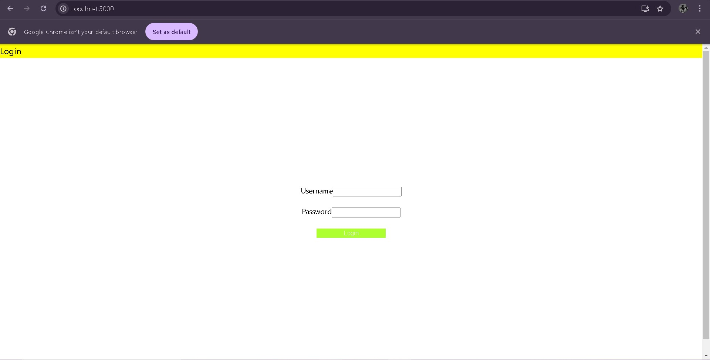
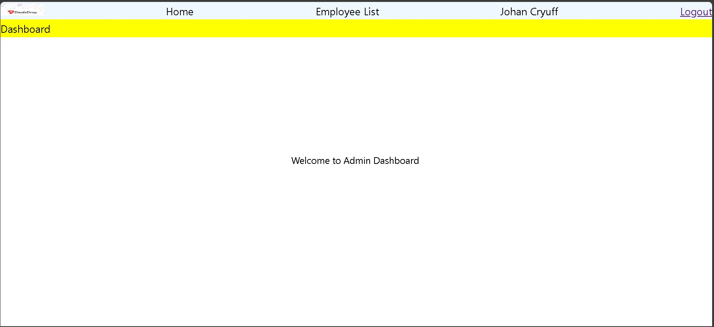
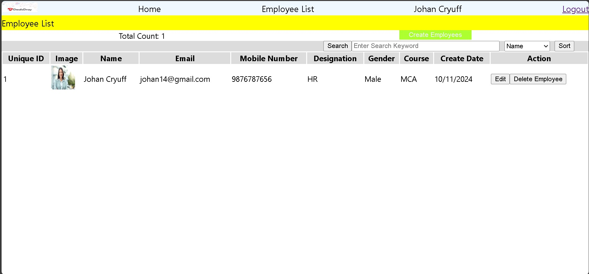
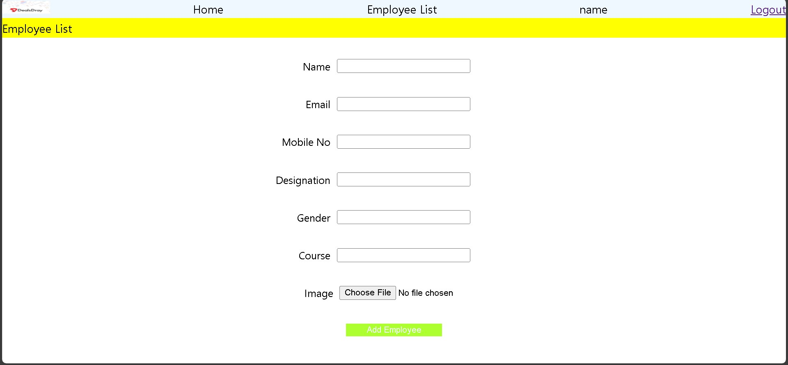
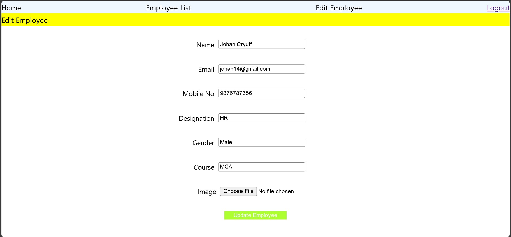

# Project Title
DealsDray MERN test
## Description
Briefly describe the purpose of the project.

## Installation
```bash

In terminal 1
1-navigate to  frontend directory
2-npm i all
3-npm start

In terminal 2 
1-navigate to  backend directory
2-npm i all
3-npm start

## Clone the repository
git clone https://github.com/swarajps/DealDray1.git


## Install dependencies
npm install


## preview
## login



##Dashboard


##employee list


##Add employee


##Edit employee details

